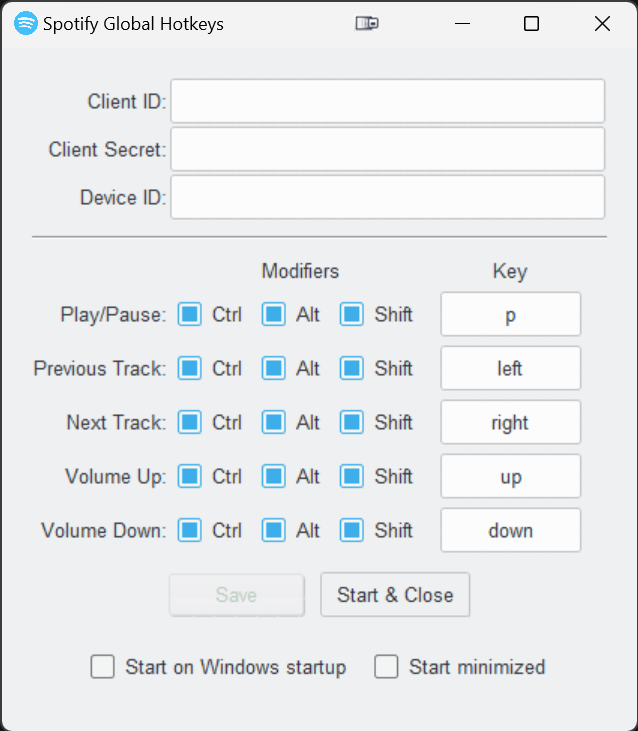
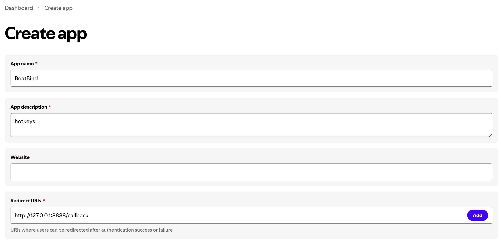
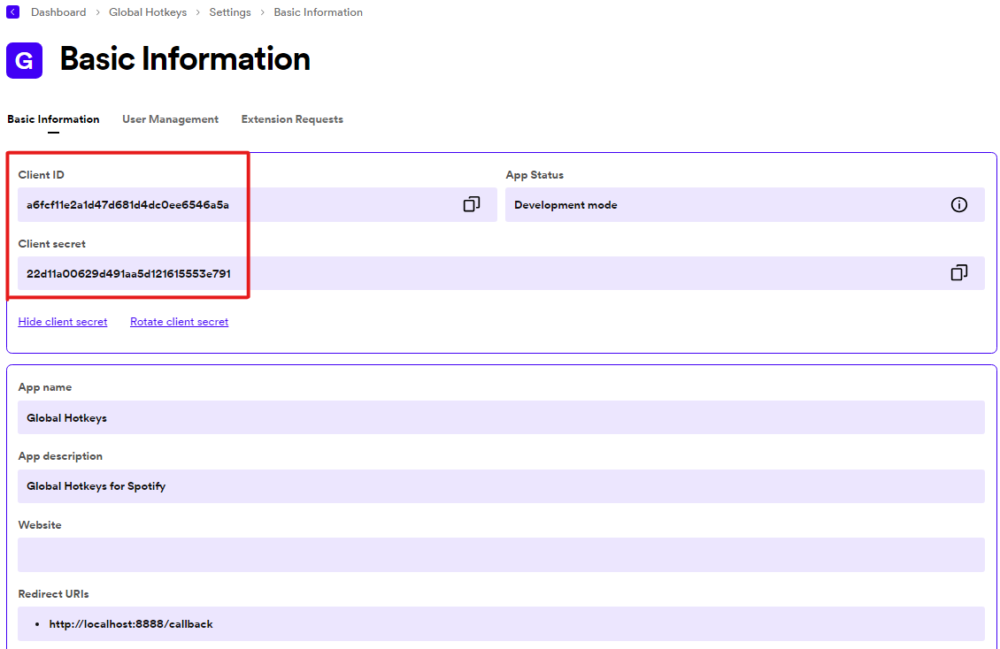
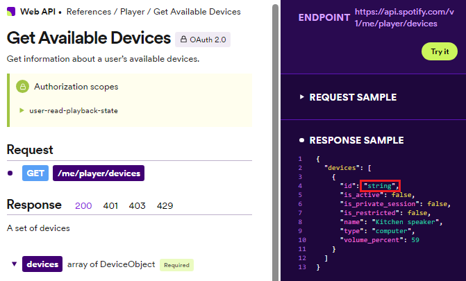

# Spotify Global Hotkeys
This background Python Windows application utilizes the [global_hotkeys](https://github.com/btsdev/global_hotkeys) module to listen for basic hotkeys, allowing users to easily control Spotify without the window focused. The app leverages the power of [Spotify's Web API](https://developer.spotify.com/documentation/web-api) through the use of [Spotipy](https://github.com/spotipy-dev/spotipy), providing seamless integration between the app and the music streaming platform.

<p align="center">

</p>

## Download
Download the latest version from the [Releases](https://github.com/justinknguyen/Spotify-Global-Hotkeys/releases) page.

You can build the `.exe` yourself with the provided build command in the `build.py` file.

## Instructions
The app requires the user to input three fields: 
- [Client ID](#client-id-and-client-secret)
- [Client Secret](#client-id-and-client-secret)
- [Device ID](#device-id)

### Client ID and Client Secret
1. To obtain the `Client ID` and `Client Secret`, head to the following link [Spotify for Developers](https://developer.spotify.com/).
1. Sign-in and click on your profile in the top-right corner, then click on "Dashboard".
1. Click on the "Create app" button to the right.
1. Enter any "App name" and "App description" you want.
1. Enter the following for the `Redirect URI`:
    - http://localhost:8888/callback
1. Click on the checkbox and then "Save".
1. Click on the "Settings" button to the top-right.
    <p align="center">
    
    </p>
1. Copy your `Client ID` and `Client Secret` and paste it into the app.
    <p align="center">
    
    </p>
### Device ID
1. To obtain your `Device ID`, head to the following link [Get Available Devices](https://developer.spotify.com/documentation/web-api/reference/get-a-users-available-devices).
1. Click on the green "Try it" button to the right.
1. Under "RESPONSE SAMPLE", is a list of all of your devices used for Spotify.
1. Find the device name of your Windows PC, and copy the "id" as this is your `Device ID` (e.g., 1f0a123g9j1201nc...).
1. Paste the `Device ID` into the app.
    <p align="center">
    
    </p>

Once you're done, click on `Save` to save your settings. Click on `Start & Close` to close the window and start listening for your hotkeys!

You can open the settings again by right-clicking on the app's system tray icon.

***
### Note: Restart the app if you changed the location of the .exe file. <br>
The registry key used to start the app on Windows startup needs to be updated to the new `.exe` path. Restarting the app will resolve that.

Quit the app by pressing on "Quit" within the system tray icon menu, or end the process in Task Manager.
***
## FAQ
### How Do I Disable Certain Hotkeys?
1. Uncheck all of the `Modifiers` checkboxes.
2. In the `Key` dropdown, select the empty option at the top.
### Where Is My Information Saved?
1. Press `Win+R` to bring up the "Run" menu, or type in "Run" within your Windows search bar.
1. Enter the following in the "Open" input field:
    ```
    %appdata%
    ```
1. Your information is stored locally within the `.../AppData/Roaming/.spotify_global_hotkeys` folder. It stores your configuration settings and the token information required to interact with Spotify's Web API.

