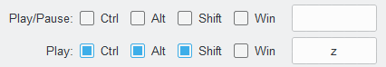

#  BeatBind - Spotify Global Hotkeys

[](https://github.com/justinknguyen/BeatBind/releases/tag/v1.1.0)

[](https://github.com/justinknguyen/BeatBind/issues)


Are you tired of constantly switching back and forth between your game and Spotify just to adjust the volume? With this app, you can finally control Spotify and adjust it's volume separately, all without the hassle of alt+tabbing. Say goodbye to interruptions and hello to effortless audio management!

This background Python Windows application utilizes the [global_hotkeys](https://github.com/btsdev/global_hotkeys) module to listen for basic hotkeys, allowing users to easily control Spotify without the window focused. The app leverages the power of [Spotify's Web API](https://developer.spotify.com/documentation/web-api) through the use of [Spotipy](https://github.com/spotipy-dev/spotipy), providing seamless integration between the app and the music streaming platform.

<p align="center">

</p>

## Download
Download the latest version from the [Releases](https://github.com/justinknguyen/Spotify-Global-Hotkeys/releases) page.

You can build the `.exe` yourself with the provided build command in the `build.py` file.
## Requirements
- Windows 10/11
- Spotify Premium
- Spotify on your device of choice
## Instructions
The app requires the user to input three fields: 
- [Client ID](#client-id-and-client-secret)
- [Client Secret](#client-id-and-client-secret)
- [Device ID](#device-id)
### Client ID and Client Secret
1. To obtain the `Client ID` and `Client Secret`, head to the following link [Spotify for Developers](https://developer.spotify.com/).
1. Sign-in and click on your profile in the top-right corner, then click on "Dashboard".
1. Click on the "Create app" button to the right.
1. Enter any "App name" and "App description" you want. Then enter the following for the "Redirect URI":
    ```
    http://localhost:8888/callback
    ```
1. Click on the checkbox and then "Save".
    <p align="center">
    
    </p>
1. Click on the "Settings" button to the top-right.
1. Copy your `Client ID` and `Client Secret` (press "View client secret") and paste it into the app.
    <p align="center">
    
    </p>
### Device ID
1. To obtain your `Device ID`, press the button "Get Devices" in the app once your `Client ID` and `Client Secret` are filled in.
1. Click on the drop-down arrow and select your device of choice.

Once you're done, click on `Save` within the app to save your settings. Click on `Start & Close` to close the window and start listening for your hotkeys!

You can open the settings again by right-clicking on the app's system tray icon.
## FAQ
### How Do I Disable Certain Hotkeys?
1. Uncheck all of the `Modifiers` checkboxes.
2. In the `Key` field, press "Backspace" or "Delete" on your keyboard to clear the field.
    <p>
    
    </p>
### Where Is My Information Saved?
1. Press `Win+R` to bring up the "Run" menu, or type in "Run" within your Windows search bar.
1. Enter the following in the "Open" input field:
    ```
    %appdata%
    ```
1. Your information is stored locally within the `.../AppData/Roaming/.beatbind` folder. It stores your configuration settings and the token information required to interact with Spotify's Web API.
### What Information Is Saved?
There are two files stored within the `.../AppData/Roaming/.beatbind` folder:
- `config.json`, which contains your Client ID, Secret, Device ID, and your hotkey combinations.
- `.cache`, which contains your token information to communicate with the Spotify app.
### Why Isn't The App Starting on Startup?
You likely changed the location of the app file. The registry key used to start the app on Windows startup needs to be updated to the new `.exe` path. Starting the app again will update the path in the registry key and should resolve the issue.
