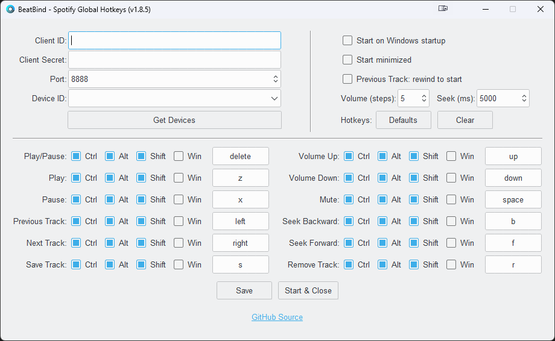

# IMPORTANT NEWS

I no longer use Spotify, but it doesn't mean I won't continue maintaining this app. I'll try my best to resolve any issues, but I can't guarantee I'll be able to solve all of them. Some issues may require Spotify Premium to resolve. 

**I will not add additional features in the meantime.**

Thanks for all of the love and support <3

#  BeatBind - Spotify Global Hotkeys


[](https://github.com/justinknguyen/BeatBind/releases/tag/v1.8.5)

[](https://github.com/justinknguyen/BeatBind/issues)

Are you tired of constantly switching back and forth between your game and Spotify just to adjust the volume? With this app, you can control Spotify and adjust it's volume separately, all without the hassle of alt+tabbing.

This background Python Windows application utilizes the [global_hotkeys](https://github.com/btsdev/global_hotkeys) module to listen for hotkeys, allowing users to easily control Spotify without the window focused. The app leverages the power of [Spotify's Web API](https://developer.spotify.com/documentation/web-api) through the use of [Spotipy](https://github.com/spotipy-dev/spotipy), providing seamless integration between the app and the music streaming platform.

You'll create your own Spotify API to control your Spotify application. YOU are the one in control. 

<p align="center">
     <br> <br>
</p>

This app does not control your Spotify locally. It sends an API request to Spotify over the internet to control your listening experience, so expect a slight delay. The delay experienced can vary depending on your internet speed.

Please see [FAQ](#faq) for more information and [Troubleshooting](#troubleshooting) if you encounter any issues. If your issue isn't listed, please create an Issue ticket.

## Table of Contents

- [Download](#download)
- [Requirements](#requirements)
- [Instructions](#instructions)
- [Updating](#updating)
- [Troubleshooting](#troubleshooting)
- [FAQ](#faq)

## Download

Download the latest version from the [Releases](https://github.com/justinknguyen/BeatBind/releases) page.

### Building the app yourself

Instead of downloading, you can build the `.exe` file yourself with the provided Nuitka build command in the [build.py](https://github.com/justinknguyen/BeatBind/blob/main/BeatBind/build.py) file.

You'll need a python environment on your local machine first and install Nuitka, then you can install all of the required packages under [requirements.txt](https://github.com/justinknguyen/BeatBind/blob/main/BeatBind/requirements.txt).

## Requirements

- Internet connection
- Windows 10/11
- Spotify App on your device of choice
- *Spotify Premium*

## Instructions

After downloading the `.zip` folder, extract the `BeatBind` folder somewhere on your computer.

*If you extracted it to your `Program Files` folder, you'll need to run the app in admin mode to be able to write and save your settings and token. I recommend placing it somewhere else.*

The app requires the user to input three fields:

- [Client ID](#client-id-and-client-secret)
- [Client Secret](#client-id-and-client-secret)
- [Device ID](#device-id)

### Client ID and Client Secret

1. To obtain the `Client ID` and `Client Secret`, head to the following link [Spotify for Developers](https://developer.spotify.com/).
1. Sign-in and click on your profile in the top-right corner, then click on "Dashboard".
1. Click on the "Create app" button to the right.
1. Enter any "App name" and "App description" you want.
1. In the app, you can change the `Port` field if it's already being used on your local network.
1. Back on the website, enter the following into "Redirect URI" with the port you chose (e.g., 8888):
   ```
   http://127.0.0.1:8888/callback
   ```
1. Click on the checkbox and then "Save".
    <p>
    
    </p>
1. Click on the "Settings" button to the top-right.
1. Copy your `Client ID` and `Client Secret` (press "View client secret") and paste it into the BeatBind app.
    <p>
    
    </p>

### Device ID

1. To obtain your `Device ID`, press the button "Get Devices" in the BeatBind app once your `Client ID` and `Client Secret` are filled in.
1. Click on the drop-down arrow and select your device of choice.
1. If you don't see your device listed:
    - Open the Spotify app (not the web player) on that device and play something, then check again.
    - If you still don't see your devices, manually obtain it by heading to this [link](https://developer.spotify.com/documentation/web-api/reference/get-a-users-available-devices) and then click on the green "Try it" button to the right. Copy and paste the id into the app. 
        <p>
        
        </p>
   

Once you're done, click on `Save` within the app to save your settings.  <br>
Then click on `Start & Close` to close the window and start listening for your hotkeys!

(You can open the settings again by right-clicking on the app's system tray icon.)

## Updating

1. Copy and save your `BeatBind/beatbind-config.json` file somewhere
1. Replace your `BeatBind` folder with the updated version
1. Paste inside the `BeatBind` folder your saved `beatbind-config.json` file

## Troubleshooting

Please go through the below steps before creating an Issue ticket.

1. Check the log file `BeatBind/beatbind.log` to see what's the problem.
1. If it's an error about tokens, delete your `.cache` file in the folder. This can happen if you changed your Spotify credentials.
1. Is your issue hotkey related? This app uses the `global_hotkeys` module by btsdev: https://github.com/btsdev/global_hotkeys. I recommend creating the Issue ticket there so they can solve your issue. Once it's solved, create an Issue ticket here and let me know to update the app.
1. Exclude the BeatBind folder from your anti-virus software.
1. If your settings are not saving, please see [Why Are My Settings Not Saving?](#why-are-my-settings-not-saving)
1. If your app is not starting/opening, please see [Why Is The App Crashing?](#why-is-the-app-crashing)
1. If your app is not starting on Windows startup, please see [Why Isn't The App Starting on Windows Startup?](#why-isnt-the-app-starting-on-windows-startup)
1. If you're getting a "Server listening on localhost has not been accessed error", please see [Server Listening On Localhost Has Not Been Accessed Error](#server-listening-on-localhost-has-not-been-accessed-error) and [Issue #12](https://github.com/justinknguyen/BeatBind/issues/12)
1. Make sure your Client ID and Secret is correct and matches what is displayed in the Spotify developer site.
1. Check if you have the Spotify app installed, and make sure the Device ID selected is the correct one.
1. Check if you're able to see the app within the system tray after pressing `Start & Close`.
1. After confirming the above and it still doesn’t work, it is likely a port problem and you’re already using the selected port on your network. Choose a different port in the app, and also change the Redirect URI set in the Spotify developer site.

## FAQ

- [Spotify Free Users?](#spotify-free-users)
- [How Do I Disable Certain Hotkeys?](#how-do-i-disable-certain-hotkeys)
- [Where Is My Information Saved?](#where-is-my-information-saved)
- [Why Are My Settings Not Saving?](#why-are-my-settings-not-saving)
- [Why Isn't The App Starting on Windows Startup?](#why-isnt-the-app-starting-on-windows-startup)
- [Why Is The App Crashing?](#why-is-the-app-crashing)
- [My Hotkeys Stop Registering After Waking From Sleep](#my-hotkeys-stop-registering-after-waking-from-sleep)
- [Server Listening On Localhost Has Not Been Accessed Error](#server-listening-on-localhost-has-not-been-accessed-error)

### Spotify Free Users?

Unfortunately, the endpoints used in Spotify's Web API only works for Spotify premium users, so it's not possible for this app to work for free users. There are other apps online that work locally instead, allowing it to work for free and premium users.

### How Do I Disable Certain Hotkeys?

1. Uncheck all of the `Modifiers` checkboxes.
1. In the `Key` field, press "Backspace" on your keyboard to clear the field.
    <p>
    
    </p>

### Where Is My Information Saved?

Your configuration settings are stored locally in `BeatBind/beatbind-config.json`.

In case you experience any issues, you can the logs in `BeatBind/beatbind.log`.

### Why Are My Settings Not Saving?

You most likely extracted the `BeatBind` folder into a location where it requires Administrator privileges, such as the `Program Files` folder. Place the `BeatBind` folder into a different location, or try running the app in admin mode.

### Why Isn't The App Starting on Windows Startup?

This happens if the location of the `.exe` file was changed. The registry key used to start the app on Windows startup needs to be updated to the new `.exe` path. Starting the app again will update the path in the registry key and should resolve the issue.

If it still does not resolve the issue, try moving the `BeatBind` folder into a another location, such as your desktop.

You can check if the registry key was added correctly in the following path of Registry Editor:
```
Computer\HKEY_CURRENT_USER\Software\Microsoft\Windows\CurrentVersion\Run
```

### Why Is The App Crashing?

- If you had "Start minimized" checked, you can find the app's icon hidden within your system tray and then right-click on it to find the settings menu.
- Within your `BeatBind` folder, delete the following files and try to open it again:
    - `beatbind-config.json`
    - `.cache`

### My Hotkeys Stop Registering After Waking From Sleep

There are rare cases where hotkeys stop registering on system wake up from sleep, and pressing `Start & Close` button again fixes the listener. For a more permanent fix, try disabling Windows Fast Startup. 

If the bug keeps occurring after disabling Fast Startup, please create an Issue ticket.

### Server Listening On Localhost Has Not Been Accessed Error

Please see the top answer solution from here https://superuser.com/questions/565409/how-to-stop-an-automatic-redirect-from-http-to-https-in-chrome

1. Go to `chrome://net-internals/#hsts`. Enter example.com under "Delete domain security policies" and press the "Delete" button.
1. Now go to `chrome://settings/clearBrowserData`, tick the box "Cached images" and "files" and press the button "Clear data".
